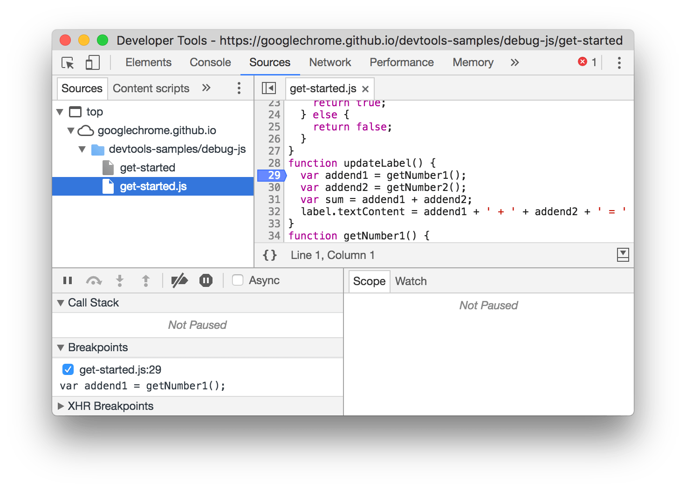

# Ferramentas do Desenvolvedor

Todo navegador possui ferramentas um conjunto de ferramentas de depuração de Web incorporado, vamos explorar o Chrome DevTools.

## Chrome DevTools

Para abrir o Chrome DevTools selecione **More Tools > Developer Tools** no menu do Google Chrome.

### Version

Para saber qual a versão do Chrome estamos utilizando (entre outras informações do navegador), digite na barra de endereços o caminho:

**chrome://version**

### Device Mode

Use o Device Mode para criar experiências web totalmente responsivas e voltadas a dispositivos móveis.

[Documentação do Device Mode](https://developers.google.com/web/tools/chrome-devtools/device-mode)

### Elements

Use o painel Elements para iterar no layout e criar um site manipulando livremente o DOM e o CSS. Examine e edite os parâmetros de modelo de caixa do elemento atual usando o painel Computed. Todos os valores no modelo de caixa são editáveis, basta clicar neles.

[Documentação do Painel Elements](https://developers.google.com/web/tools/chrome-devtools/inspect-styles)

### Console

Use o Console para registrar informações de diagnóstico durante o desenvolvimento ou como shell para interagir com o JavaScript da página.

[Documentação do Console](https://developers.google.com/web/tools/chrome-devtools/console)

### Sources

Depure o JavaScript usando pontos de interrupção no painel Sources ou conecte seus arquivos locais por meio de Espaços de trabalho para usar o editor em tempo real do DevTools.

[Documentação de Sources](https://developers.google.com/web/tools/chrome-devtools/javascript/breakpoints)

### Network

Monitore todoas as requisições que o site realiza. Use o painel Network para obter insights sobre recursos solicitados e baixados e otimizar o desempenho do carregamento da página. 

[Documentação de Network](https://developers.google.com/web/tools/chrome-devtools/network/resource-loading)